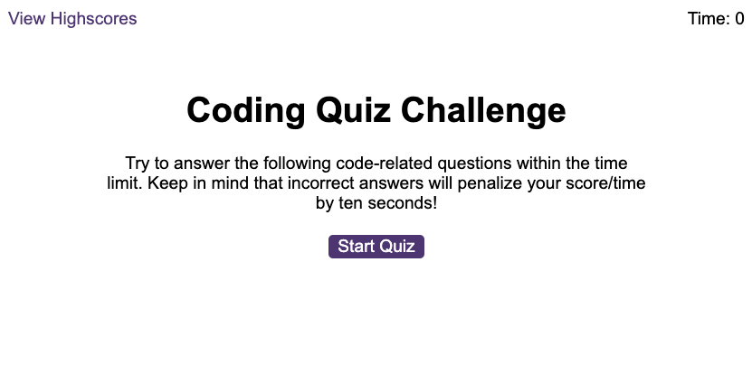

# JavaScript Quiz Game
## Description
In this assignement I had to create an app that runs in the browser and features dynamically updated HTML and CSS, all powered by JavaScript.

My task was to create a Coding Quiz about JavaScript

When you click the button "Start Quiz", the application presents a series of questions with multiple choice answers, the quiz is timed the countdown start at 60 seconds.

The acceptance criteria for this exercise were as follow:

GIVEN I am taking a code quiz
- WHEN I click the start button
- THEN a timer starts and I am presented with a question
- WHEN I answer a question
- THEN I am presented with another question
- WHEN I answer a question incorrectly
- THEN time is subtracted from the clock
- WHEN all questions are answered or the timer reaches 0
- THEN the game is over
- WHEN the game is over
- THEN I can save my initials and score

As an additional challenge I added a soud for correct and incorrect answer.

The application fully rensponsive for all the screen sizes.

### Link to the deployed application 
https://rafdimartino.github.io/module-6-challenge-code-quiz/

## Installation
N/A

## Usage
Clikc on "Start Quiz" button, you will be prompted with a series of random question about the JavaScript programming language, click one of the multiple choices.
You have 60 seconds to answer as many questions as you can, every incorrect answer will deduct 10 seconds from the countdown timer. When the timer ends you will be able to add you initials and save you results in the browser local storage, you can access it by clicking on leftend corner link "View Highscores"

Good Luck!

## Credits
N/A

## License
Please refer to the LICENSE in the repo.